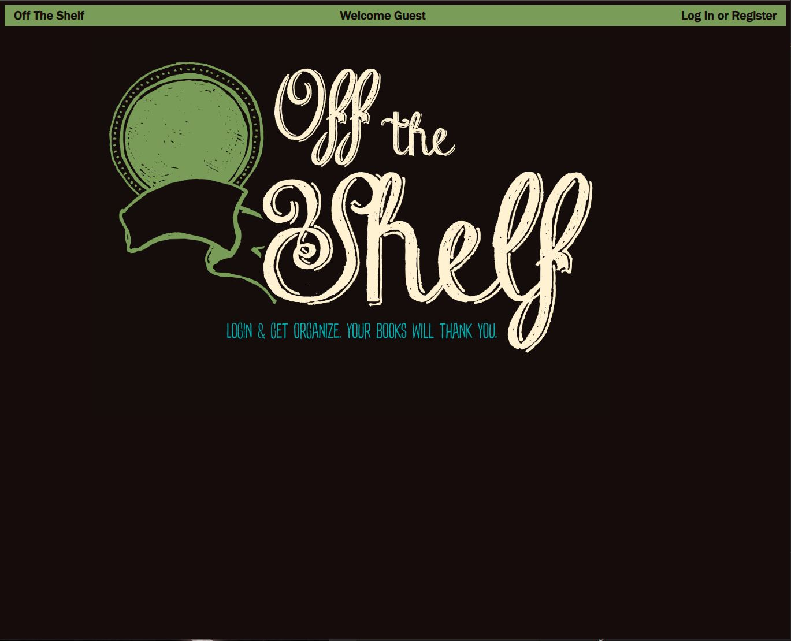
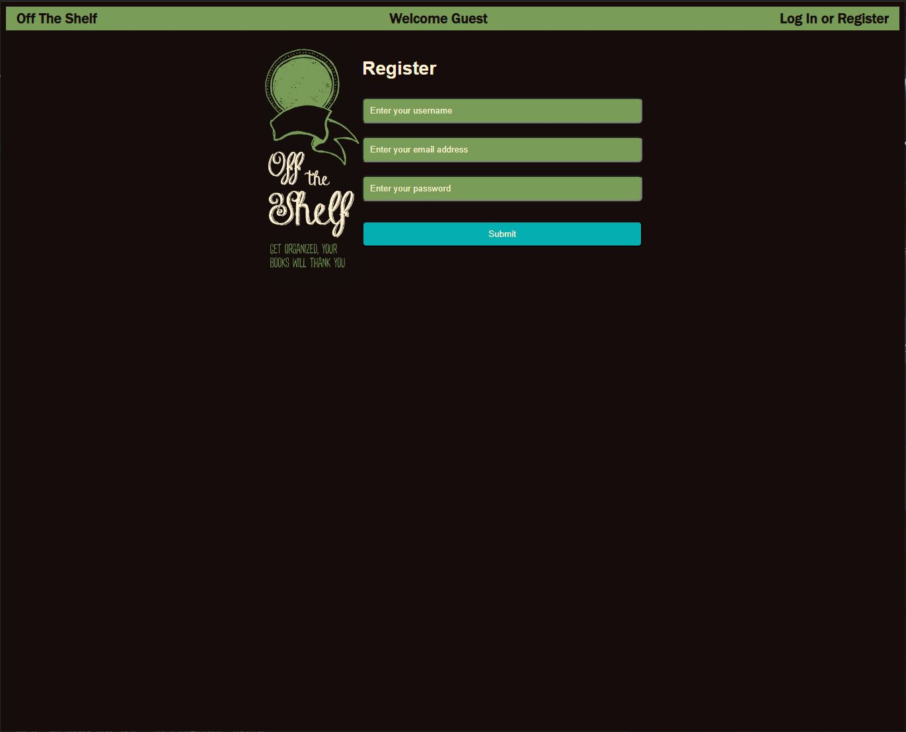
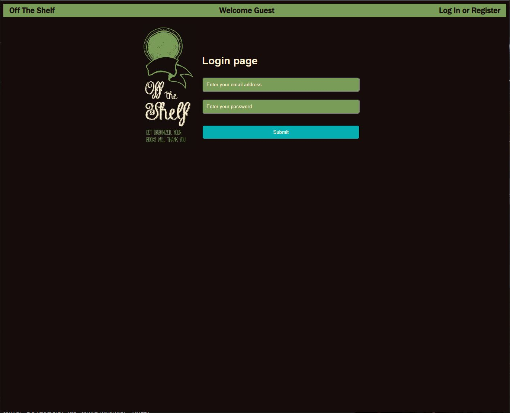
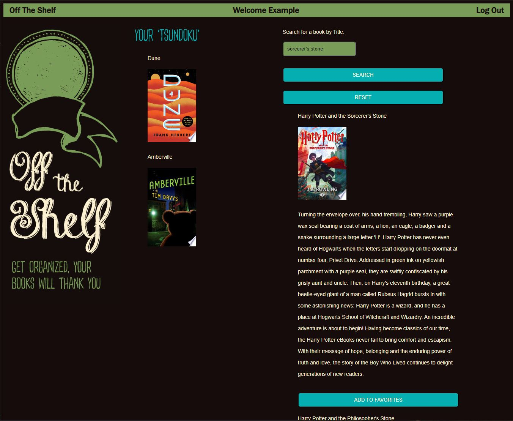
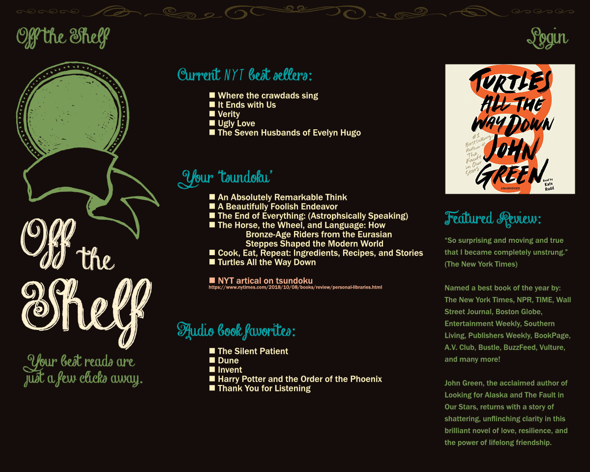

# Off The Shelf (Project-2)
collaborators : Brett, Spencer, Tony and James

## Description
Off the shelf is an application that allows a user to create a profile and save their library collection to their profile. There they can manage their book collection, and utilize their list to pick which book they would like to read next.

Heroku: https://off-the-shelf-project-2.herokuapp.com/  
Github: https://github.com/jbuck123/Project-2  

## Visuals

### Root Page

### Registration Page

### Login Page

### What You See When Logged In

## Initial Plan

## Installation
Requirements that need to be downloaded include express, mysql, howler.js, anime.js, and bcrypt.
